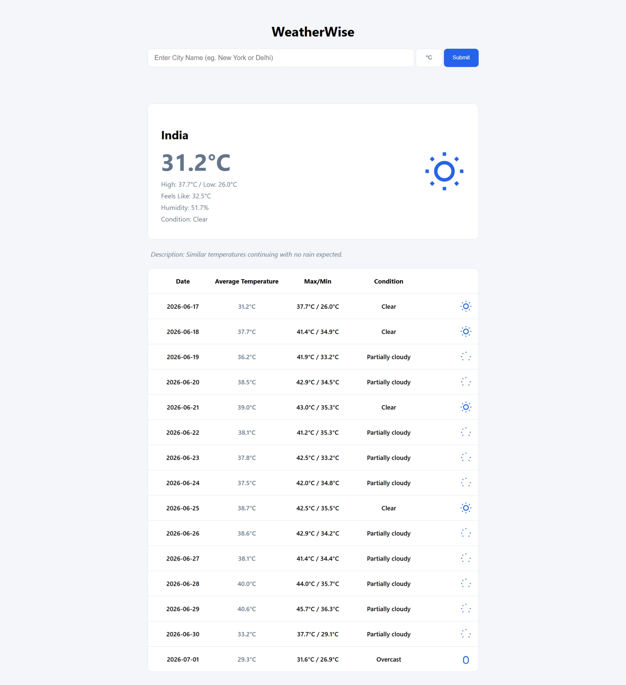

# WeatherWise: A Weather App Project

A browser-based weather dashboard built with vanilla JavaScript and webpack. The app lets you search for a location, view the current weather, inspect a multi-day forecast, and switch between Celsius and Fahrenheit.



## Features

- Search weather by city, region, or country name.
- View current conditions, including temperature, humidity, feels-like temperature, and condition summary.
- Review a forecast table with daily average, max, and min temperatures.
- Toggle temperature units between `°C` and `°F`.
- See loading and error states while weather data is being fetched.
- Render weather icons based on the current forecast condition.

## Tech Stack

- JavaScript (ES modules)
- HTML5
- CSS3
- webpack
- Visual Crossing Weather API

## Project Structure

```text
.
├── package.json
├── webpack.common.js
├── webpack.dev.js
├── webpack.prod.js
└── src/
    ├── index.js
    ├── UIController.js
    ├── weatherAPI.js
    ├── iconRegistry.js
    ├── index.html
    └── css/
        └── style.css
```

## Getting Started

### Prerequisites

- Node.js and npm installed locally.

### Installation

1. Clone the repository.
2. Install dependencies:

```bash
npm install
```

### Run the app locally

Start the development server:

```bash
npm run dev
```

This launches webpack dev server and opens the app in your browser.

### Build for production

Create an optimized production bundle:

```bash
npm run build
```

### Deploy

The project includes a deploy script that publishes the generated `dist` folder to the `gh-pages` branch:

```bash
npm run deploy
```

## How It Works

1. On load, the app fetches weather data for a default location.
2. When you submit a new location, the app requests fresh data from the API.
3. The response is normalized into a smaller app state object.
4. The UI is re-rendered to show the current weather and forecast.
5. Clicking the unit toggle recalculates temperatures in the selected unit without re-fetching the data.

## API Source

This project uses the Visual Crossing Weather API to retrieve weather data.

Note: the API request is currently made directly from the client-side code in `src/weatherAPI.js`.

## Credits

Built as part of **The Odin Project: Weather App Project**.
